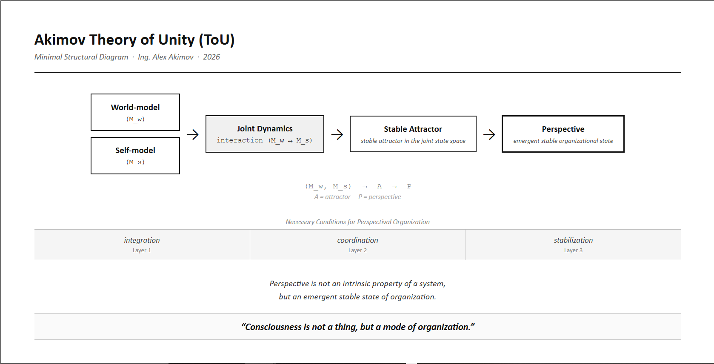

## Citation / DOI

This work is publicly archived and citable via Zenodo:

DOI: https://doi.org/10.5281/zenodo.19198910
---

## Official Submission PDF

Final official submission version:

[Download the final PDF (EN, v1.5)](docs/Akimov_ToU_v1.5_Official_Submission_EN_2026.pdf)

SHA-256:
`3ef51db300a22f88460e90c08ba7e81e3f49ee1cddd3f704fae22636eb480bfd`

## Quick Entry Overview

### Akimov Theory of Unity (ToU)  
**A Minimal Entry Overview**

**Author:** Ing. Alex Akimov  
**Year:** 2026

---

### 1. Core Question

What is a “perspective” in a complex system?

Rather than treating perspective (or consciousness) as an intrinsic property, the Akimov Theory of Unity (ToU) approaches it as a structural and dynamical phenomenon.

### 2. Central Hypothesis

A perspective emerges when the interaction between two internal components of a system stabilizes into a coherent configuration:

- **world-model (M_w)**
- **self-model (M_s)**

Perspective is defined as a stable attractor in the joint dynamics of **(M_w, M_s)**.

### 3. Key Idea

**Consciousness is not a thing, but a mode of organization.**

### 4. Formal View

**(M_w, M_s) → attractor**

### 5. Status

Conceptual and formal research framework.  
Defines a structured basis for future empirical and computational testing.

---
# Akimov Theory of Unity (ToU)

**Author:** Ing. Alex Akimov  
**Year:** 2026  

---

## Description

The Akimov Theory of Unity (ToU) is a formal research framework focused on the emergence of perspectival organization in complex systems.

It proposes that what we call "perspective" (or conscious viewpoint) is not an intrinsic property of a system, but a stable dynamical state arising from the interaction between:

- world-model (M_w)  
- self-model (M_s)

---

## Structural Diagram

The formal structure of the Akimov Theory of Unity (ToU) is represented by the following diagram:

This diagram illustrates the emergence of perspective as a stable attractor in the joint dynamics of the world-model (M_w) and self-model (M_s).

It serves as a visual formalization of the theoretical framework and supports further analytical, computational, and empirical development.

---

## Core Idea

Perspective emerges when the joint dynamics of (M_w, M_s) converge to a stable attractor.

Consciousness is therefore not a thing, but a mode of organization.

---

## Research Position

This work is formulated as a **Lakatosian research programme**, providing:

- a formal conceptual framework  
- a core theoretical structure  
- a basis for future empirical and computational testing  

---

## Contents

- `docs/` → research documents (EN, SK, PDF)  
- `legal/` → cryptographic proof (SHA-256 hash)  

---

## Status

**PUBLIC LOCK — Version 1.1**  
Submission-ready academic material.  
Currently under submission to arXiv.

---

## Citation

If you use or reference this work, please cite:

Akimov, A. (2026).  
*A Formal Framework for Perspectival Organization in Complex Systems*.  
Zenodo. https://doi.org/10.5281/zenodo.19197979

---

## Keywords

perspectival organization, complex systems, consciousness, artificial intelligence,  
self-model, world-model, dynamical systems, emergence, cognitive systems

---

## Authorship Statement

All theoretical contributions are authored solely by Ing. Alex Akimov.

AI systems were used exclusively as analytical tools for generating alternative formulations and potential objections.  
They did not contribute original theoretical content and do not hold authorship status.

---

## License

© 2026 Ing. Alex Akimov  
All rights reserved.
